<picture>
  <source media="(prefers-color-scheme: light)" srcset="assets/light.svg">
  <source media="(prefers-color-scheme: dark)" srcset="assets/dark.svg">
  
</picture>

```
██╗   ██╗
██║   ██║
██║   ██║
╚██╗ ██╔╝
 ╚████╔╝
  ╚══╝
```

###  About

```yaml
name: Blackwall-V
role: Data Scientist | ML Engineer
location: Chile
focus: Applied machine learning · CRISP-DM · PyCaret · open data
stack: Python, Rust, Lua, Linux
status: Open to collaboration
```

###  Stats

<p align="center">
  
  
</p>

<p align="center">
  
  
</p>

###  Stack

<table>
  <tr>
    <td align="center" width="120"><br><sub>Python</sub></td>
    <td align="center" width="120"><br><sub>Pandas</sub></td>
    <td align="center" width="120"><br><sub>scikit-learn</sub></td>
    <td align="center" width="120"><br><sub>Jupyter</sub></td>
    <td align="center" width="120"><br><sub>Rust</sub></td>
    <td align="center" width="120"><br><sub>Linux</sub></td>
  </tr>
</table>

###  Pinned

<!-- HOTLIST:START -->
- **[Data_Mining](https://github.com/Blackwall-V/Data_Mining)** — Supervised regression on public health data (CRISP-DM pipeline, 159K records).
- **[Rem-20-pycaret](https://github.com/Blackwall-V/Rem-20-pycaret)** — PyCaret experiments on REM-20 data.
- **[mp3-converter-](https://github.com/Blackwall-V/mp3-converter-)** — Python audio converter.
- **[bug-free-tribble-csv](https://github.com/Blackwall-V/bug-free-tribble-csv)** — AI-generated CSV for ML testing.
<!-- HOTLIST:END -->

<p align="center">
  <a href="https://github.com/Blackwall-V?tab=followers"></a>
  <a href="https://github.com/Blackwall-V?tab=repositories"></a>
</p>

<p align="center">
  <sub>Pure SVG · SMIL animations · light &amp; dark aware · GitHub-compatible</sub>
</p>
